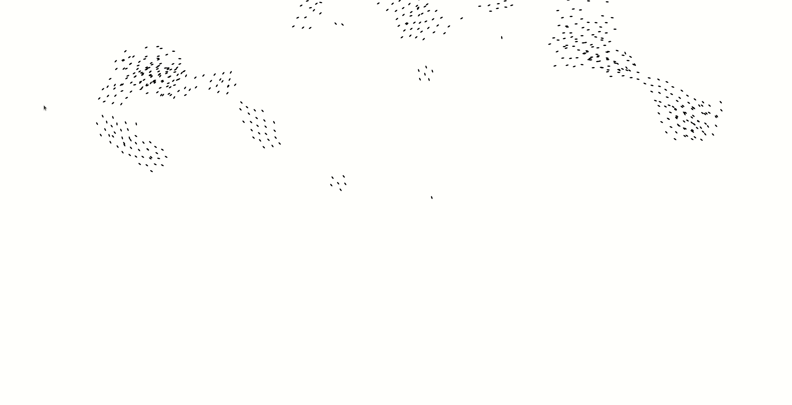

# wasm-boids

   

A Rust 🦀 and WebAssembly 🕸 implementation of Craig Reynolds boids algorithm.
Implemented using a KD-Tree for fast nearest neighbour search.

Improvements:
1. Bird FOV
2. WebGL implementation to speed up drawing of boids ( taking approximately 25%
   of execution time right now)
3. 3D version in WebGL
4. Seperate WebWorker for running the neighbour search
